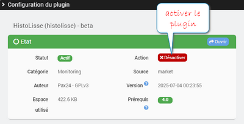
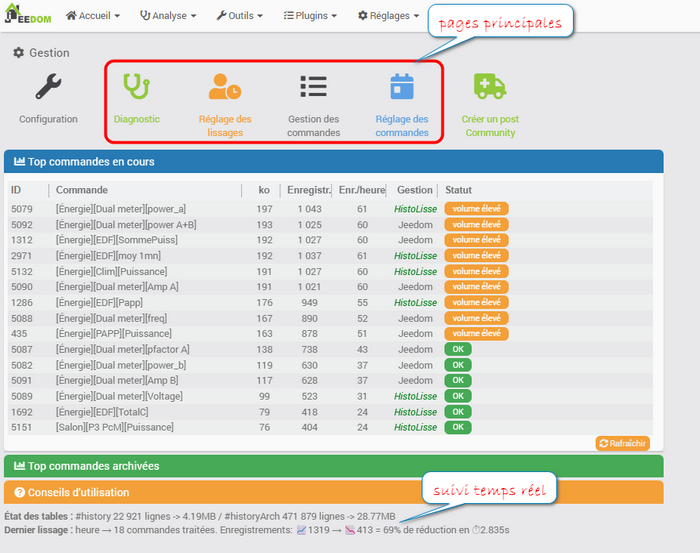
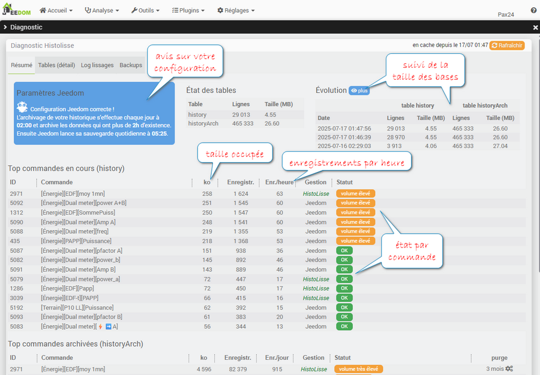
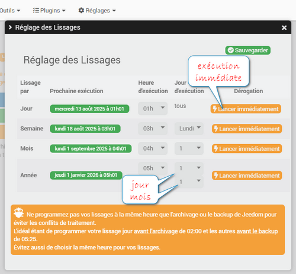
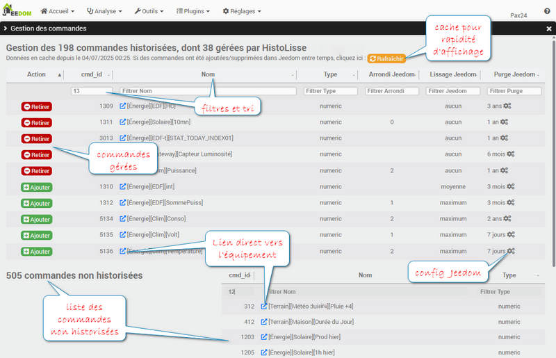
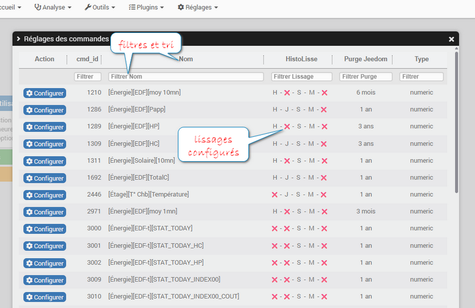
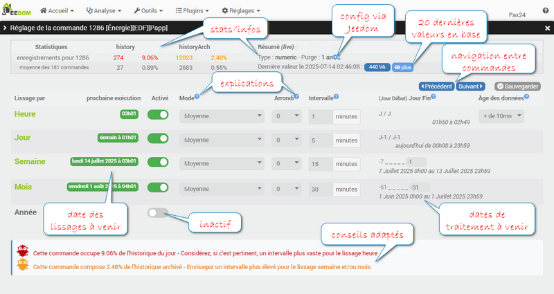
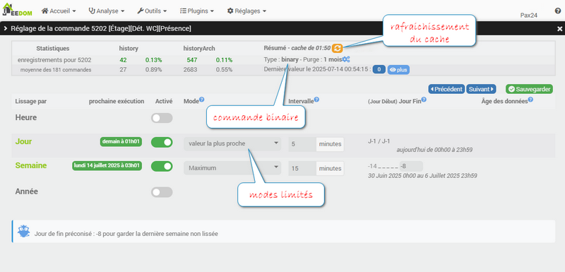
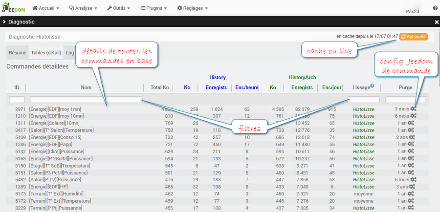
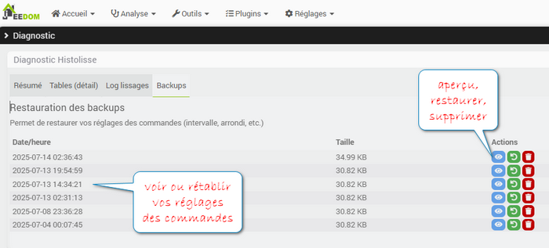

[🔙 Retour au sommaire](index.md)

## activer

Une fois installé, activer le plugin via la page **configuration**.  
N'hésitez pas à consulter la [FAQ](faq.md) pour des explications plus techniques.

## accueil

Il y a 4 pages principales, les pages Diagnostic et Réglage des commandes étant celles que vous fréquenterez le plus.  
Il y a aussi la possibilité d'ouvrir un nouveau sujet sur la section du forum Jeedom dédiée à ce plugin.

## diagnostic

Jetez un oeil sur l'onglet résumé de la page **Diagnostic** pour vérifier votre configuration et les commandes gourmandes.  
Vous retrouvez ici l'état des tables et leur évolution dans le temps. Ainsi qu'un résumé Top15 des commandes occupants le plus de place dans les tables history et historyArch.

Quoi que vous fassiez, il y aura toujours des commandes avec un "volume élevé", c'est normal puisque ce volume est calculé par rapport à la moyenne générale.

Comme partout dans le plugin les tables sont triables en cliquant sur les en-têtes de colonnes.
  
🧠 Lorsqu'une mise en cache existe comme ici et sur d'autres pages, il y a la possibilité, via le bouton rafraîchir, de renouveler ce cache.

## lissages
  

Réglez les horaires de traitement via Réglage des Lissages.  
À chaque sauvegarde, les dates de prochaine exécution sont mises à jour afin de contrôler que cela correspond à ce que vous voulez.  
Prenez en compte votre configuration Jeedom pour éviter les conflits de traitement et les lenteurs.

## gestion

Commencez par ajouter des commandes, via la **Gestion**, qui seront désormais gérées par le plugin (sauf la purge qui reste gérée par Jeedom)

Le lien direct vers l'équipement ouvre dans une nouvelle fenêtre l'équipement contenant cette commande.  
Le lien vers la fenêtre de configuration Jeedom ne permet que de modifier la purge et la répétition des valeurs. Si vous voulez modifier le reste, qui n'est ici que pour info, il faut ouvrir la page de l'équipement.

## réglages

Ensuite ouvrez le **Réglage des commandes** pour configurer chaque commande.

### type

Les commandes de type numérique ont plus de possibilités.
Retrouvez pour chaque commande ses statistiques dans les 2 tables, les infos de base comme le délai avant la purge. La dernière valeur et sa date, en voir plus avec les 20 dernières valeurs dans chacune des tables. Un menu de navigation entre les commandes.

Ici, vous réglez les lissages pour cette commande :
- Son **mode** de lissage, c'est la façon dont vont être regroupées les données (Moyenne des valeurs, minimum : garder la valeur la plus basse, Maximum : la plus haute, Valeur la plus proche : de la minute de l'intervalle), suivant le type de la commande (numeric, binary, autre). 
- Le nombre de décimales pour l'**arrondi** : doit être inférieur ou égal à l'arrondi du lissage précédent. 
- L'**intervalle**, c'est-à-dire le nombre de minutes entre 2 valeurs enregistrées.  
Retenez bien qu'un intervalle d'1 minute donne 1440 enregistrements sur une seule journée.  
⚠️ *HistoLisse n'inventera pas les données ! Donc si vous avez mis un intervalle pour Heure à 5 min (soit 12 valeurs enregistrées par heure) vous ne pouvez pas mettre un intervalle inférieur pour Semaine (par exemple 1 minute = 60 valeurs par heure dont 48 n'existent pas), il sera forcément au moins égal à 5 min ou plus.*
- Pour le lissage par heure, vous pouvez décider de ne pas lisser les dernières données qui ont moins de 1 minute, 10 minutes, 1 h etc, en réglant l'**âge des données** (Bloc non lissé) : Les données traitées seront plus âgées que cette durée. 
 - Ex1 : + de 4h => à 9h on lissera les données de 4h00 à 4h59, les dernières données entre 5h00 et 9h00 (bloc de 4h) ne seront pas encore lissées. Ex2 : + de 1 minute => à 9h on lissera les données de 7h59 à 8h58 inclus.
- Pour les lissages, semaine, mois et année, il y a en plus le **jour de fin** de la plage de données **à la date d'exécution programmée**. Sachant que le jour de début de la plage sera automatiquement assigné en fonction du lissage (-6 pour semaine, -30 pour mois et -365 pour année). Les dates correspondantes sont indiquées en dessous à chaque fois que vous modifiez le jour de fin.  
Ex de jour Fin : -8 pour 1 semaine avant, -31 pour 1 mois avant. Doit être inférieur ou égal à -1.
- En fonction des stats et infos, des conseils sont donnés par Hector.

💡 *Si des lissages ne sont pas proposés, c'est en raison du délai de purge (par exemple, si purge=7 jours, vous ne verrez pas le lissage semaine).* 

Un exemple **complet** de lissage par Année est détaillé dans la [FAQ](faq.md)

Les commandes de type binaire et string sont limitées sur les modes.  
Valeur la plus proche signifie au plus proche de l'intervalle : s'il est de 5 min on gardera les points à h00 h05 h10... c'est la donnée historisée le plus proche de cette minute qui sera donc conservée.  
Sauf exception, laissez Jeedom gérer ce type de commande, il le fait très bien.

⚠️ *Vous aurez toujours des commandes en rouge ou en orange parce qu'il y a forcément des commandes avec plus de données que la moyenne. Cela reste une indication pour comprende quelle commande sont à traiter en priorité.*

### détails

Via **Diagnostic** vous avez accès aux détails de toutes les commandes historisées.  
Vous retrouverez la taille totale de tous les enregistrements et le détail par table. Vous pouvez trier via les entêtes et filtrer.

### backups

Si vous avez fait une erreur vous pouvez voir et/ou restaurer un ancien réglage via Diagnostic → onglet Backups.  
Les backups sont gérés de façon incrémentielle mais il y aura toujours les 2 plus récents.

### historique

Consultez via Diagnostic  → onglet Log lissages, le résultat des lissages (autres que par heure). Cet historique permet de garder une trace des grands lissages ainsi que le cumul pour chaque commande traitée par mois et ce pour les 3 derniers mois.

### et après ?
Consultez la [FAQ](faq.md) pour des explications plus détaillées/techniques.

[🔙 Retour au sommaire](index.md)