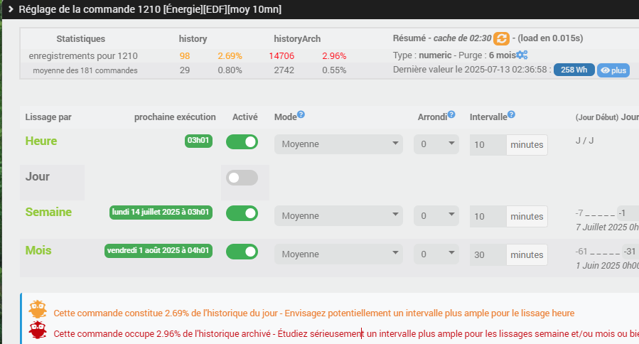

  

# 📘 Documentation du plugin HistoLisse

Bienvenue dans la documentation officielle du plugin Jeedom **HistoLisse**.

---

## 📚 Sommaire

- [🔧 Installation](installation.md)
- [⚙️ Fonctionnalités](fonctionnalites.md)
- [❓ FAQ](faq.md)

---

## Aperçu

